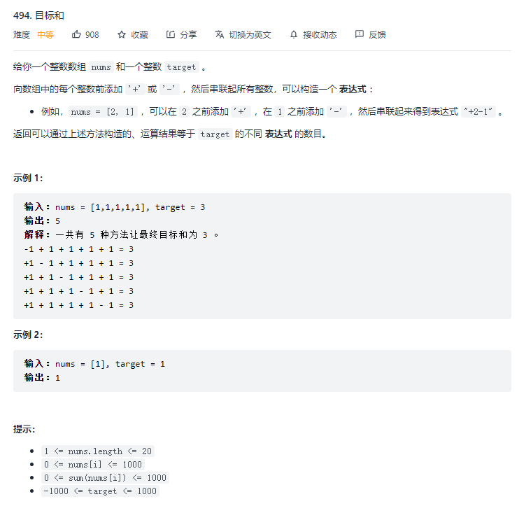

# 494. 目标和 - Medium

## 题干



## 题解

0-1 背包问题的通用解法如下，一般都会以在 i 之前是否/有多少种方法能组成 j 的模式来构造 dp\[i\]\[j\]，最终通过逐行递推的方式填满 dp 数组，因此也可以通过一个一维数组进行状态压缩。

```javascript
function KP (nums, target) {
  var n = nums.length, t = target
	var dp = new Array(n + 1).fill(0).map(v => new Array(t + 1).fill(0))
  for (var i = 0; i <= n; i++) {
  	dp[i][0] = 1
  }
  for (var i = 1; i <= n; i++) {
  	for (var j = 1; j <= t; j++) {
      // 状态转移
    }
  }
  return dp[n][t]
}
```

回归到本题的解法：

* 基本就是套通用解法，只是在套之前需要把问题转化为标准的 0-1 背包问题；
* 本题要求用到背包中所有的元素，这点不符合 0-1 背包，要转化为可以取任意元素；
* 发现 使用 + 标记 和 使用 - 标记 的元素是任意的，且 + 部分的和 与 -部分的差 相加可得 target；
* 由于两部分加起来就是 nums 所有数字的和 numsSum，因此 \(numsSum - target\) / 2 就是小那一半的和；
* 所以将每个背包的目标值转化为 \(numsSum - target\) / 2，问题就可以转化为标准的 0-1 背包问题。

```javascript
/**
 * @param {number[]} nums
 * @param {number} target
 * @return {number}
 */
var findTargetSumWays = function(nums, target) {
  if (!nums || !nums.length) return 0

  var sum = nums.reduce((accu, curr) => accu + curr, 0)
  if ((sum - target) % 2 !== 0 || (sum - target) < 0) return 0
  var n = nums.length, t = (sum - target) / 2
  var dp = new Array(n + 1).fill(0).map(() => new Array(t + 1).fill(0))
  dp[0][0] = 1
  for (var i = 1; i <= n; i++) {
    dp[i][0] = nums[i - 1] === 0 ? dp[i - 1][0] * 2 : dp[i - 1][0]
  }
  for (var i = 1; i <= n; i++) {
    for (var j = 1; j <= t; j++) {
      if (j - nums[i - 1] < 0) {
        dp[i][j] = dp[i - 1][j]
      } else {
        dp[i][j] = dp[i - 1][j - nums[i - 1]] + dp[i - 1][j]
      }
    }
  }
  return dp[n][t]
};
```

