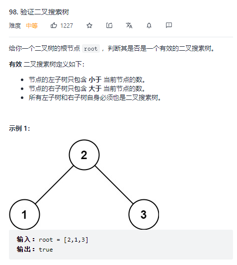

# 98. 验证二叉搜索树 - Medium

## 题干



## 题解

首先抛出 BST 的基本结构：

```javascript
/**
 * @param {TreeNode} root
 * @return {boolean}
 */
var isValidBST = function(root) {
  // do something...
  isValidBST(root.left)
  isValidBST(root.right)
};
```

在使用递归解法时，首先需要关注对于正在操作的树节点需要做些什么。本题需要验证一棵树是否 BST，那么对于每一个节点来说，val 必须比左节点大，比右节点小，且左右子树也都为 BST，因此得出第一阶段的代码：

```javascript
/**
 * @param {TreeNode} root
 * @return {boolean}
 */
var isValidBST = function(root) {
  if (!root) return true
  if ((root.left && root.val <= root.left.val) || (root.right && root.val >= root.right.val)) return false
  return isValidBST(root.left) && isValidBST(root.right)
};
```

有这样一种情况：

```text
    2
   / \
  1   3
     / \
    1   4
```

这棵树明显不是一颗 BST，因为不满足右侧所有节点均大于当前节点这个条件，此时我们发现，上面那段代码仅仅比较了当前节点的左右子节点，而完全无法对左右子树每一个节点进行比较。因此我们考虑封装一个辅助函数，用于保存递归过程中左右子树的最大最小值：

```javascript
/**
 * @param {TreeNode} root
 * @return {boolean}
 */
var isValidBST = function(root) {
  var traverse = function (root, min, max) {
    if (!root) return true
    if ((min && root.val <= min.val) || (max && root.val >= max.val)) return false
    // 递归过程中将当前节点的值作为左子树的最大值，右子树的最小值传入
    return traverse(root.left, min, root) && traverse(root.right, root, max)
  }
  return traverse(root, null, null)
};
```

提交通过。

